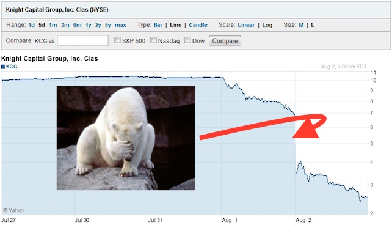

<!-- .slide: class="titlePage" -->

## Is my app still up?

#### Application Monitoring in the Cloud Native Age

Note:
Welcome and Introduction

---

## What does it mean to be Cloud-native

* Container packaged
* Dynamically managed
* Micro-services oriented

Source: Cloud Native Computing Foundation

---

## Why do we monitor

 <!-- .element: class="fragment current-visible" data-fragment-index="1" -->

Note:
There are many reasons to have monitoring in place.
Knight's capital group lost $440 when faulty code ran undetected for 45 minutes on their servers
You never want to get called by a customer about a bad user experience

---

## What do we monitor

It depends <!-- .element: class="fragment current-visible" data-fragment-index="1" -->

Note:
You have to determine what matters for your application
No silver bullet

---

## What do we monitor

* Latency
* Bounce rate
* Errors
* ...

Note:
Store front: latency - example amazon
Marketing website: bounce rate
Internal website like a wiki: errors
Batch processing: accounts payable - monitor queue

---

## How do we monitor

Request Tracing

Note:
Now going back to my little app, it's a micro service.
Zipkin

---

## How do we monitor

Binding monitoring services

Note:
NewRelic, AppDynamics, DynaTrace

---

## How do we monitor

Log output

Note:
Logalyzer

---

## How do we monitor

Latency

Note:
Show new plugin
Forget percentiles

---

## How do we monitor

Monitoring Java via JMX

Note:
Show sample

---

## How do we monitor

Monitoring Go via pprof

Note:
Show sample

---

## How do we monitor

Monitor everywhere

Note:
Monitor in Dev and Test to catch issues before they hit prod

---

## Alerting

Leverage your monitoring data

Note:
Anomaly detection

---

## Thank you
